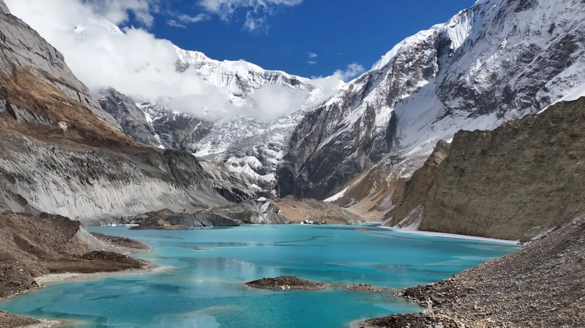

# 🏔️ North ABC Expedition

> A cinematic web experience documenting the real journey of 10 friends to North Annapurna Base Camp, Nepal.

---

## ✨ About

**North ABC Expedition** is an immersive scroll-driven storytelling website that documents a real 5-day trek to North Annapurna Base Camp (4,130m) in the Myagdi District of Nepal. The website features real photos, videos, and stories from 10 friends who made the journey together.

### 🎯 Features

- 🎬 **Cinematic loader** with mountain animation
- 🏔️ **Real photo hero section** with parallax effects
- 👥 **Interactive crew profiles** with modal popups
- 📅 **Day-by-day timeline** with photos and stories
- 🌊 **Phutphute Waterfall section** with video playback
- ⛺ **Camp Life stories** with auto-rotating moments
- 🗺️ **Interactive expedition map** with photo locations
- 📸 **Filterable photo gallery** with lightbox
- 🚤 **Pokhara finale** with the legendary boating incident video
- 💫 **Smooth scroll** powered by Lenis
- 📱 **Fully responsive** — works on all devices

---

## 🛠️ Tech Stack

| Category       | Technology |
|----------------|------------|
| **Framework**  | React 18 + Vite |
| **Styling**    | Vanilla CSS (custom design system) |
| **Animation**  | GSAP + ScrollTrigger |
| **Motion**     | Framer Motion |
| **Smooth Scroll** | Lenis |
| **Fonts**      | Playfair Display, Space Grotesk, Space Mono (Google Fonts) |

---

## 🚀 Getting Started

### Prerequisites

- Node.js 18+ and npm
- Git

### Installation

\`\`\`bash
# Clone the repository
git clone https://github.com/YOUR_USERNAME/north-abc-expedition.git
cd north-abc-expedition

# Install dependencies
npm install

# Start development server
npm run dev
\`\`\`

The site will be available at \`http://localhost:5173\`

### Build for Production

\`\`\`bash
npm run build
npm run preview
\`\`\`

---

## 📁 Project Structure

\`\`\`
north-abc-expedition/
├── public/
│   ├── images/             # All trek photos
│   │   ├── crew/           # Individual crew member photos
│   │   ├── day1/ to day5/  # Photos organized by day
│   │   ├── hero-bg.jpg
│   │   └── group-photo.jpg
│   └── videos/             # Trek videos
│       ├── hero-reel.mp4
│       ├── waterfall.mp4
│       └── boating-incident.mp4
├── src/
│   ├── components/
│   │   ├── Loader/         # Cinematic loading screen
│   │   ├── Hero/           # Hero section
│   │   ├── Crew/           # 10 crew member profiles
│   │   ├── Timeline/       # Day-by-day journey
│   │   ├── Waterfall/      # Phutphute waterfall section
│   │   ├── CampLife/       # Camp moments stories
│   │   ├── Map/            # Interactive route map
│   │   ├── Gallery/        # Photo masonry grid
│   │   ├── Pokhara/        # Final day & boating
│   │   ├── Ending/         # Closing section
│   │   └── UI/             # HUD, NavDots
│   ├── data/               # Static content
│   │   ├── crew.js
│   │   ├── timeline.js
│   │   ├── gallery.js
│   │   └── mapPoints.js
│   ├── hooks/              # Custom React hooks
│   ├── utils/              # Helper functions
│   ├── App.jsx
│   ├── main.jsx
│   └── index.css
├── index.html
├── package.json
└── vite.config.js
\`\`\`

---

## 🖼️ Adding Your Own Content

### Photos
Place your photos in the appropriate folders:
- \`public/images/crew/\` — Individual crew photos (filename matches \`photo\` in \`src/data/crew.js\`)
- \`public/images/day1/\` through \`day5/\` — Daily trek photos
- \`public/images/hero-bg.jpg\` — Main hero background
- \`public/images/group-photo.jpg\` — Squad photo

### Videos
Place videos in \`public/videos/\`:
- \`hero-reel.mp4\` — Background loop for hero (optional)
- \`waterfall.mp4\` — Phutphute waterfall video
- \`boating-incident.mp4\` — Pokhara boating video

### Customize Content
Edit the data files in \`src/data/\` to update:
- Crew member info (\`crew.js\`)
- Day-by-day stories (\`timeline.js\`)
- Map locations (\`mapPoints.js\`)
- Gallery captions (\`gallery.js\`)

---

## 🎨 Customization

### Colors
Edit CSS variables in \`src/index.css\`:

\`\`\`css
:root {
  --c-gold: #d4a574;      /* Primary accent */
  --c-orange: #e8956a;    /* Secondary accent */
  --c-bg: #080810;        /* Background */
  --c-text: #f0ece4;      /* Text */
}
\`\`\`

### Fonts
Update the Google Fonts link in \`index.html\` and CSS variables.

---

## 🌍 Deployment

### Deploy to Vercel (Recommended)

1. Push your code to GitHub
2. Visit [vercel.com/new](https://vercel.com/new)
3. Import your repository
4. Vercel auto-detects Vite and deploys
5. Done! 🎉

### Deploy to Netlify

\`\`\`bash
# Build the project
npm run build

# Drag and drop the 'dist' folder to netlify.com/drop
\`\`\`

### Manual Deployment

Build the project and upload the \`dist/\` folder to any static hosting:
- GitHub Pages
- Cloudflare Pages
- Firebase Hosting
- AWS S3 + CloudFront

---

## 👥 The Expedition Team

| # | Name | Role |
|---|------|------|
| 01 | Anjef Dangol | The Capturer & Developer |
| 02 | Nabin Maharjan | The Guide |
| 03 | David Maharjan | Adventure Seeker |
| 04 | Salim Maharjan | The Banker |
| 05 | Sau Bhagya Dangol | Energy Booster |
| 06 | Rishav Maharjan | The SBackbone |
| 07 | Azay Maharjan | The Chef |
| 08 | Dr. Sabin Maharjan | Tent Builder |
| 09 | Shreeshan Maharjan | The Calm One |
| 10 | Biju Shrestha | The Chef |

---

## 📊 The Trek Stats

- **Duration:** 5 Days
- **Distance:** 67.5+ km
- **Highest Point:** 4,130m (North ABC)
- **Starting Point:** Kathmandu → Pokhara → Beni
- **Route:** Beni → Tatopani → Humkhola → Phutphute → Busket Mela → Panchakunda → North ABC

---

## 🤝 Contributing

This is a personal expedition documentation project, but feel free to:
- ⭐ Star the repo if you like it
- 🐛 Report bugs via Issues
- 💡 Suggest features
- 🔀 Fork it to create your own trek story

See [CONTRIBUTING.md](./CONTRIBUTING.md) for details.

---

## 📝 License

This project is licensed under the **MIT License** — see the [LICENSE](./LICENSE) file for details.

**Photos and videos** are © 2024 The North ABC Expedition Team and are NOT covered by the MIT license. They are for personal viewing only. Please contact the team for any usage rights.

---

## 🙏 Acknowledgments

- Built with [React](https://react.dev) + [Vite](https://vitejs.dev)
- Animations by [GSAP](https://gsap.com) & [Framer Motion](https://www.framer.com/motion/)
- Smooth scroll by [Lenis](https://github.com/studio-freight/lenis)
- Fonts from [Google Fonts](https://fonts.google.com)
- Special thanks to the people of Myagdi district for their hospitality

---

## 📬 Contact

**Anjef Dangol** — Developer & Expedition Member

- 🌐 Website: https://www.anjef.com.np/
- 📸 Instagram: [@anjef.dangol](https://instagram.com/anjef.dangol)
- 💼 GitHub: [@YOUR_USERNAME](https://github.com/d-anjef)

---

**🏔️ Made with ❤️ in Kathmandu, Nepal**

*"10 friends walked into the mountains. All 10 came back. Mostly dry."*

